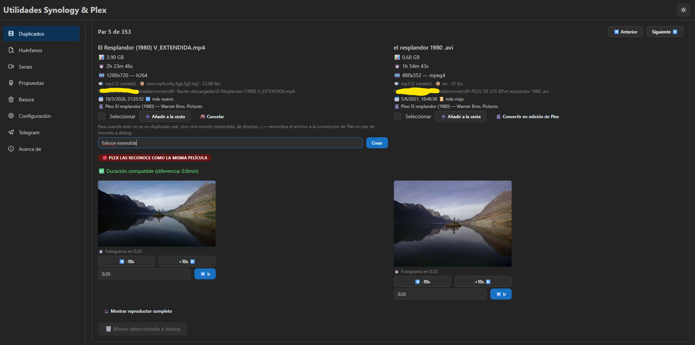

# 🛠️ Utilidades Synology & Plex

Aplicación web (FastAPI + React) para organizar una biblioteca de vídeo
local: detecta **películas y series duplicadas**, encuentra **archivos sin
indexar en Plex** (con ayuda de IA para renombrarlos), sube vídeos a
**Telegram** con carátula y sinopsis, y contrasta todo contra **Plex,
TMDB/OMDb/IMDB**. Interfaz adaptativa a móvil, pensada para un único
contenedor accesible solo por LAN o Tailscale.

> 📖 **¿Primera vez?** Antes de nada, sigue [SETUP.md](SETUP.md) para
> apuntar la app a tu propio NAS (rutas, base de datos de Plex, API keys y
> acceso remoto por Tailscale).

## ✨ Funcionalidades

### 🔍 Duplicados de películas
- Escaneo recursivo de carpetas con detección por similitud de nombre + año
- Filtro por duración configurable para descartar falsos positivos
- Comparación por fotograma (mucho más rápido que reproducir el vídeo
  completo, sobre todo en carpetas de red), con botones ◀ -10s / +10s ▶ y
  un campo para saltar directo a un minuto exacto — útil para reconocer
  la película cuando el nombre de archivo no dice nada
- Reproductor de vídeo completo embebido, opcional, para cuando el
  fotograma no basta
- Tamaño, duración y resolución reales (no solo lo calculado en el
  escaneo) justo antes de decidir qué eliminar
- Navegación por pares, con guardado/carga del progreso de un escaneo
- Metadatos de Plex por par (título, año, estudio, duración) y aviso si
  Plex ya las reconoce como la misma película
- **Convertir en Edición de Plex**: cuando dos "duplicados" son en
  realidad dos versiones distintas de la misma película (extendida vs.
  teatral, Director's Cut...), un botón por archivo renombra el
  archivo a la convención de Plex (`Película {edition-Nombre}.ext`) en
  vez de moverlo a debug — con sugerencias rápidas (Director's Cut,
  Extendida, 4K...) y refresco automático de la biblioteca
- Lista con checkboxes para descartar de golpe pares que a simple
  vista no son duplicados reales, sin tener que revisarlos uno a uno




### 🧩 Huérfanos (películas sin indexar en Plex)
- Detecta archivos en disco que Plex no tiene indexados
- Sugerencia de nombre con IA: **Ollama** (local, gratis), **OpenAI** o
  **Gemini**, a elegir — individual o en lote (con límite configurable y
  botón de detener, para colecciones grandes)
- La sugerencia de la IA se contrasta contra **TMDB/OMDb** antes de
  aceptarla (mejor título en español vía TMDB, año real de la base de
  datos en vez de un año inventado por el modelo)
- Si el nombre de archivo no dice nada (títulos crípticos, nombres de
  escena...), el mismo visualizador con fotograma navegable de
  duplicados permite "hojear" el vídeo hasta encontrar los créditos o
  cualquier escena que revele de qué película se trata
- Modo "sugerir" (confirmas tú cada renombrado) o "automático"
- Listados paginados para colecciones grandes


### 📺 Series
- Detecta capítulos duplicados, capítulos sueltos sin indexar y **series
  enteras sin indexar en Plex** (agrupadas por serie, con desplegable)
- Compara por episodios indexados, no por título de serie — así una serie
  con título traducido en Plex (p.ej. "Earth Abides" en disco vs. "La
  Tierra Permanece" en Plex) no sale como falso "sin indexar"
- Permite marcar series como "ignoradas" de forma permanente
- Guardado/carga de progreso, igual que en duplicados y huérfanos

### 🗑️ Basura / Purgatorio
- La app **nunca borra nada directamente** — modo debug siempre activo,
  no se puede desactivar desde la interfaz: todo lo eliminado o
  renombrado se mueve primero a una carpeta de debug configurable
- Vista dedicada con el contenido de esa carpeta (separado en películas /
  capítulos de serie), tamaño total ocupado y, si indicas el tamaño
  aproximado de tu biblioteca, qué porcentaje llevas ya "purgado"
- **Restaurar** archivos a su carpeta original con un checkbox, sin tener
  que ir a buscarlos a mano por el NAS
- Vaciarla de verdad (borrado real) es una acción manual tuya en el NAS,
  la app nunca lo hace por ti ni automática ni manualmente


### 🤖 Propuestas (revisión asistida, con aviso por email)
- Escaneo programado (hora configurable, o bajo demanda con un botón) que
  revisa las carpetas configuradas y genera dos tipos de propuesta:
  - **Huérfanos**: nombre sugerido por IA, igual que en la pestaña
    Huérfanos pero centralizado aquí
  - **Duplicados**: qué copia borrar, **solo cuando Plex tiene la
    resolución de ambos archivos indexada** — compara calidad vs. tamaño
    con un umbral configurable ("¿compensa X% / Y GB más por mejor
    resolución?") y nunca arriesga una recomendación sin datos fiables
- Revisión en lote: casillas + un único botón "Aplicar/Descartar
  seleccionadas" (un solo refresco para varias propuestas, no uno por
  clic — pensado para revisar desde el móvil)
- Descartar una propuesta es **permanente** ("no, ese no, no me lo
  vuelvas a proponer"), con lista reversible desde la propia pantalla
- Aviso por email (SMTP, Gmail con contraseña de aplicación por defecto)
  con enlace directo a esta pantalla — el programador interno vive dentro
  de la propia app, sin depender de crear nada en el NAS
- Alternativa opcional: un botón en ⚙️ Configuración crea la misma tarea
  directamente en el **Planificador de tareas de tu Synology** (requiere
  un usuario DSM dedicado en `.env`, ver [SETUP.md](SETUP.md)) — para
  quien prefiera que el disparo no dependa de que el contenedor esté
  encendido justo a esa hora

### 🎬 IMDB / TMDB / OMDb
- Sinopsis, pósteres y datos (rating, director, actores, género)
- TMDB como fuente primaria (mejor cobertura en español), con OMDb como
  contraste/fallback

### 📱 Telegram
- Subida de vídeos a un canal, con carátula + sinopsis antes del vídeo
- Dos vías de subida: **Bot API** (archivos pequeños) y **Telethon**
  (sesión de usuario, para archivos grandes que superan el límite del Bot
  API)

### 🗄️ Plex
- Conexión de **solo lectura** a la base de datos de Plex
- Cruce de duplicados, huérfanos y series contra tu biblioteca real
- Refresco de biblioteca desde la propia app tras renombrar/mover archivos

### ⚙️ Configuración (pantalla dentro de la app)
- Un único recurso con pestañas para Detección, Reproductores/Debug, Plex,
  Telegram (solo lectura), **Programación** (carpetas/hora/email de
  Propuestas, más el botón opcional de tarea en el Planificador de
  Synology) e IA (proveedor/modelo para sugerencia de nombres)
- Las API keys/tokens **no están aquí a propósito**: viven solo en `.env`,
  nunca en un campo de la UI que pueda acabar guardado en `config.json`

### ℹ️ Acerca de (pantalla dentro de la app)
- Qué hace cada pantalla, cómo configurarlo todo, y cómo restaurar la
  base de datos de Plex desde sus copias de seguridad si algo fallara —
  pensada para no tener que salir de la app ni volver a este README una
  vez instalada

## 🛠️ Tecnología

**Backend** — Python 3.11, [FastAPI](https://fastapi.tiangolo.com/) +
[Uvicorn](https://www.uvicorn.org/). Un router por recurso
(`src/api/routers/`), Pydantic para validar request/response. Las
operaciones largas (escaneos, subidas, sugerencias en lote) corren en
un `ThreadPoolExecutor` propio (`src/api/jobs.py`) y empujan progreso
en tiempo real por **WebSocket** (`/ws/jobs/{id}`, con `/api/jobs/{id}`
como respaldo por HTTP si el WS no llega) — nada de recargar la página
para ver si ha terminado.

**Frontend** — [React](https://react.dev/) + [Vite](https://vitejs.dev/)
+ TypeScript, [Mantine v7](https://mantine.dev/) como librería de
componentes (incluye el modo oscuro/claro), [TanStack
Query](https://tanstack.com/query) para todo el estado de servidor
(caché, refetch, loading/error), [React Router](https://reactrouter.com/)
para la navegación por pantallas. Sin Redux/Zustand: el estado de
cliente (fila seleccionada, par actual...) es `useState` normal, no
hay suficiente estado compartido entre pantallas para justificar más.

**Despliegue** — un único contenedor Docker: FastAPI sirve tanto la
API (`/api/*`, `/ws/*`) como el build estático de React (todo lo
demás, con fallback a `index.html` para que las rutas de React Router
funcionen al entrar directo o recargar) — sin nginx aparte. Cómo
construir y desplegar la imagen, más abajo en "🐳 Alternativa: Docker +
Portainer".

## 🚀 Instalación

```bash
git clone <tu-fork-o-este-repositorio>
cd find_video_duplicates
pip install -r requirements.txt
```

O con los instaladores incluidos:

```bash
# Windows
setup\instalar_dependencias.bat
setup\run_app.bat

# Linux/Mac
chmod +x setup/run_app.sh
./setup/run_app.sh

# Cualquier plataforma
python setup/install_dependencies.py
python main.py
```

La app se abre en `http://localhost:8000`.

**Después de instalar**, sigue [SETUP.md](SETUP.md) para configurar tus
rutas reales, la base de datos de Plex y las API keys — sin eso la app
arranca pero no tiene nada que escanear.

### 🐳 Alternativa: Docker + Portainer (Synology u otro NAS, sin instalar Python)

Construye la imagen con uno de estos dos scripts (mismo resultado,
elige el de tu plataforma):

```bash
# Windows
build_docker_image.bat

# Linux/Mac/Git Bash
./build_docker_image.sh
```

Los dos construyen la imagen desde la raíz del repo (`docker/Dockerfile`,
incluye el build del frontend React) y la dejan en
**[`.imagen_docker/`](.imagen_docker/)** (carpeta local, no se sube a
git salvo el `.tar` — ese sí queda fuera por ser un binario grande y
regenerable):

- `find-video-duplicates.tar` — la imagen exportada, lista para `docker load`
- `docker-compose.yml` — el stack, para pegar directamente en Portainer o usar con `docker-compose up`
- `env.template` — plantilla de variables (rutas, puerto, Tailscale)

**Instalación en el Synology (Container Manager, Portainer, o cualquier
host con Docker):**

1. Copia el contenido de `.imagen_docker/` (los tres ficheros) a una
   carpeta del NAS — con Container Manager, esa carpeta es la del
   propio "Proyecto" que crees.
2. Carga la imagen: `docker load -i find-video-duplicates.tar`
3. Copia `env.template` a `.env`, **en esa misma carpeta** (junto al
   `docker-compose.yml`, no un nivel por encima), y rellena tanto las
   rutas (`MOVIES_PATH`, `PLEX_DB_PATH`, `DATA_PATH`...) como tus
   claves (`TELEGRAM_*`, `TMDB_API_KEY`, `OMDB_API_KEY`,
   `OPENAI_API_KEY`/`GEMINI_API_KEY`, `SMTP_USER`/`SMTP_PASSWORD`...) —
   todo en un único fichero, nunca en claro en el `docker-compose.yml`.
4. En Container Manager: **Proyecto → Crear**, apunta a esa carpeta
   (con el `docker-compose.yml` y el `.env` dentro) y créalo. También
   puedes hacerlo a mano con `docker-compose -f docker-compose.yml up -d`.

   Con **Portainer** (Stacks → Add stack, método "Web editor"): pega el
   contenido de `docker-compose.yml`, y en su sección **"Environment
   variables"** usa el botón **"Load variables from .env file"** para
   subir el mismo `.env` (o pégalo a mano ahí) — Portainer con Web
   editor no lee un `.env` del disco del NAS por sí solo, genera el
   suyo propio a partir de esa sección.
5. Acceso: el contenedor publica el puerto en `0.0.0.0` (igual que el
   resto de contenedores del NAS), así que entras tanto desde tu LAN
   como, si tienes el paquete Tailscale de Synology instalado, desde
   cualquier dispositivo de tu tailnet con la IP `100.x.x.x` del NAS —
   sin configurar nada más. No expuesto a internet salvo que abras ese
   puerto en el router.
6. La primera vez, entra a **⚙️ Configuración** dentro de la propia app
   para terminar de ajustar Plex, carpeta de debug, etc. — queda
   guardado en el volumen de datos (`DATA_PATH/config.json`), no en la
   imagen, así que sobrevive a recrear el contenedor.

La imagen **nunca lleva datos personales horneados dentro** —
`config.json` y `.env` se montan como volumen en tiempo de ejecución,
así que la misma imagen sirve tanto para ti como para compartirla. Guía
más detallada en [docker/README.md](docker/README.md).

## 📁 Estructura del Proyecto

```
find_video_duplicates/
├── main.py                          # Punto de entrada (abre navegador, Tailscale-friendly)
├── scheduled_scan.py                # Entrypoint sin interfaz para Propuestas (tarea externa opcional)
├── build_docker_image.bat           # Construye la imagen Docker (Windows)
├── build_docker_image.sh            # Igual, para Linux/Mac/Git Bash
├── requirements.txt
├── README.md
├── SETUP.md                         # Configuración paso a paso (rutas, Plex, Tailscale)
├── .env.example                     # Plantilla de secretos — cópiala a .env
├── .dockerignore
│
├── docker/                          # Receta Docker (versionada, sin secretos ni datos personales)
│   ├── Dockerfile                   # Contexto = raíz del repo, código siempre actual
│   ├── docker-compose-synology.yml
│   ├── env.template                 # Plantilla de docker/.env (rutas, puerto, TZ)
│   └── README.md
│
├── .imagen_docker/                  # Salida de build_docker_image.{bat,sh}: imagen
│   │                                 # exportada (.tar, no versionado) + compose/env.template
│   │                                 # listos para copiar a Portainer/Synology
│
├── frontend/                        # UI (React + Vite + Mantine), servida por FastAPI en producción
│   └── src/
│       ├── features/                # Una carpeta por pantalla (duplicates, orphans, series, ...)
│       ├── components/              # Componentes compartidos (navegación, tabla, fotograma...)
│       └── api/                     # Cliente HTTP + hook de progreso por WebSocket
│
├── src/
│   ├── api/                         # Backend FastAPI
│   │   ├── main.py                  # App, routers, montaje del frontend build
│   │   ├── jobs.py                  # Jobs en segundo plano con progreso por WebSocket
│   │   ├── routers/                 # Un router por recurso (duplicates, orphans, series, ...)
│   │   └── schemas/                 # Modelos Pydantic de request/response
│   ├── services/
│   │   ├── ai_naming_service.py     # IA (Ollama/OpenAI/Gemini) + contraste TMDB/OMDb
│   │   ├── proposals_service.py     # Genera propuestas (nombres IA + qué duplicado borrar)
│   │   ├── email_service.py         # Aviso por email (SMTP) de propuestas nuevas
│   │   ├── scan_scheduler.py        # Programador interno (hilo en segundo plano, hora configurable)
│   │   ├── plex_service.py
│   │   ├── plex_refresh_service.py
│   │   ├── scan_data_manager.py     # Guardado/carga de progreso de escaneos
│   │   ├── video_info_service.py
│   │   ├── Imdb/                    # Búsqueda de películas en Plex/OMDb, para nombres y enriquecer subidas
│   │   └── Telegram/                # Bot API + Telethon
│   ├── settings/
│   │   ├── settings.py              # Singleton de configuración
│   │   ├── config.example.json      # Plantilla — cópiala a config.json
│   │   └── env_template.txt         # Plantilla — cópiala a .env
│   └── utils/
│       ├── movie_detector.py        # Similitud de nombres para películas
│       ├── series_detector.py       # Parseo SxxExx / NxNN, agrupado por serie
│       └── video.py                 # Extracción de fotogramas (ffmpeg)
│
└── setup/                           # Instaladores por plataforma
```

## ⚙️ Configuración

Ver **[SETUP.md](SETUP.md)** para la guía completa (rutas de tu NAS, dónde
está la base de datos de Plex en un Synology, variables de entorno y
acceso remoto por Tailscale).

Resumen rápido:

```bash
cp src/settings/config.example.json src/settings/config.json
cp src/settings/env_template.txt .env
```

Después edita `config.json` y `.env` con tus valores, o ajústalos desde la
pestaña ⚙️ Configuración de la propia app. Ambos ficheros están en
`.gitignore`: puedes meter tus rutas y claves reales sin miedo a subirlas.

## 🎮 Uso rápido

1. **Duplicados**: elige carpeta en el menú lateral, ajusta umbral de
   similitud y filtro de duración, pulsa "🔍 Escanear".
2. **Revisar pares**: navega con Anterior/Siguiente, compara por fotograma
   o vídeo completo, decide si eliminar (va a la papelera) o mover.
3. **Huérfanos**: deja que la IA sugiera nombre y contrástalo antes de
   renombrar.
4. **Series**: mismo flujo pero por episodios y series enteras.
5. **Basura**: revisa qué se ha ido acumulando en la papelera antes de
   vaciarla tú a mano en el NAS.
6. **Propuestas**: revisa lo que la app te sugiere (nombres de huérfanos,
   duplicados a borrar), marca casillas y aplica/descarta en lote.
   Configura carpetas/hora/email en ⚙️ Configuración → 📅 Programación.
7. **Telegram**: subida opcional a un canal, con carátula y sinopsis si
   activas "Enriquecer".

## 🔒 Seguridad

- La app **nunca borra archivos directamente**: todo pasa primero por la
  carpeta de debug/papelera configurada. El modo debug está siempre
  activo y, de momento, no se puede desactivar desde la interfaz.
- La conexión a Plex es **de solo lectura**: `PlexService` solo abre la
  base de datos con `mode=ro` y, si esa conexión falla, **nunca** cae a
  una conexión editable como red de seguridad — antes sí lo hacía, y se
  corrigió porque es una vía real de corrupción (ver más abajo).
- ⚠️ **SQLite y rutas de red no son buena combinación.** La base de datos
  de Plex normalmente vive en una carpeta de red (SMB/CIFS), y SQLite no
  garantiza el bloqueo de archivos correcto ahí — si algo más (otra
  herramienta, un script propio) abre esa misma base de datos en modo
  escritura mientras Plex la tiene abierta, puede corromperla (error
  típico: `database disk image is malformed`, Plex sin arrancar y en
  bucle de reinicio). Esta app siempre se conecta en solo lectura, pero
  si escribes tus propios scripts contra esa ruta, ábrela también en
  modo `ro` (`sqlite3.connect(f"file:{ruta}?mode=ro", uri=True)`). Ver la
  solución si ya te ha pasado en **[🐛 Solución de problemas](#-solución-de-problemas)**.
- Las claves de API y tokens viven solo en `.env` / `config.json`, ambos
  excluidos de git — nunca se hardcodean en el código, ni tampoco en
  campos editables de la UI (por diseño, para que no acaben en
  `config.json` por accidente).
- **La app no tiene login propio.** Si la expones por Tailscale (recomendado,
  ver [SETUP.md](SETUP.md#5-acceso-remoto-por-tailscale-sin-abrir-puertos)),
  la única barrera es pertenecer a tu tailnet — cualquiera fuera de ella
  no puede alcanzarla ni probando IPs, porque las direcciones `100.x.x.x`
  no son enrutables desde fuera de tu propia red Tailscale. El riesgo real
  es que se comprometa tu cuenta de Tailscale, no que adivinen la IP.
- Con Docker (`docker-compose-synology.yml`), el puerto solo se publica en
  tu IP de Tailscale, nunca en `0.0.0.0` — ni tu propia LAN sin Tailscale
  puede alcanzarlo.
- Email de Propuestas: `SMTP_PASSWORD` debe ser una **contraseña de
  aplicación** de Gmail (16 caracteres, myaccount.google.com/apppasswords),
  no tu contraseña normal — esta última da error de credenciales.

## 🐛 Solución de problemas

Ver la sección de problemas comunes en **[SETUP.md](SETUP.md#7-problemas-comunes)**
para lo relacionado con rutas, Plex y acceso remoto.

Otros problemas frecuentes:

- **"La API ya está ejecutándose"**: hay un proceso previo ocupando el
  puerto 8000 (`taskkill /f /im python.exe` en Windows, `pkill -f
  main.py` en Linux/Mac).
- **"Mutagen no disponible"**: `pip install mutagen>=1.47.0`.
- **Error 401 en OMDb/TMDB**: revisa que la API key en `.env` sea correcta.
- **Plex no arranca, log con "database disk image is malformed"**: la
  base de datos de Plex se ha corrompido (ver el aviso en
  [🔒 Seguridad](#-seguridad) sobre SQLite en rutas de red). Se recupera
  con las copias de seguridad automáticas que el propio Plex genera
  periódicamente, en la misma carpeta que la base de datos activa
  (`Plug-in Support/Databases/`), con la fecha en el nombre:
  `com.plexapp.plugins.library.db-YYYY-MM-DD` y su pareja
  `com.plexapp.plugins.library.blobs.db-YYYY-MM-DD`.

  1. **Para Plex** (Container Manager / Docker → detener el contenedor).
  2. **No borres nada** — renombra los archivos actuales (añádeles algo
     como `.corrupto`): `com.plexapp.plugins.library.db`, `-wal`, `-shm`,
     `com.plexapp.plugins.library.blobs.db` y sus `-wal`/`-shm` si existen.
  3. **Copia** (no muevas) la pareja fechada más reciente y quítales la
     fecha del nombre al copiarlas:
     `com.plexapp.plugins.library.db-YYYY-MM-DD` → `com.plexapp.plugins.library.db`
     `com.plexapp.plugins.library.blobs.db-YYYY-MM-DD` → `com.plexapp.plugins.library.blobs.db`
  4. Arranca Plex de nuevo.

  Perderás la actividad (visto/no visto, añadidos) desde la fecha de esa
  copia hasta ahora, pero el resto de la biblioteca se recupera intacta.

## 🤝 Contribuir

1. Fork del repositorio
2. Crea una rama (`git checkout -b feature/nueva-funcionalidad`)
3. Commit de tus cambios
4. Push y abre un Pull Request

---

**¡Disfruta organizando tu colección! 🎬✨**
