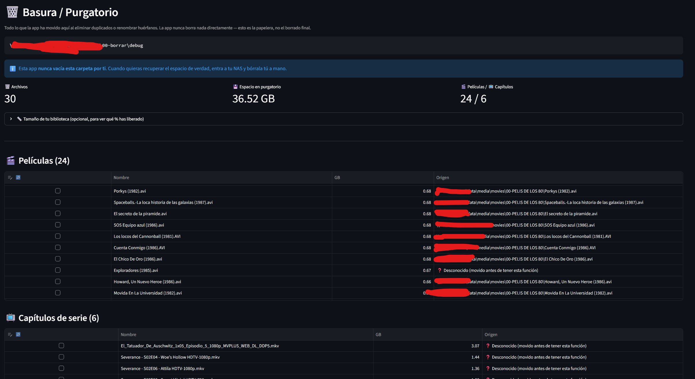

# 🎬 Detector de Películas y Series Duplicadas

Aplicación en Python con Streamlit para organizar una biblioteca de vídeo
local: detecta **películas y series duplicadas**, encuentra **archivos sin
indexar en Plex** (con ayuda de IA para renombrarlos), y contrasta todo
contra **Plex, TMDB/OMDb/IMDB y Telegram**.

> 📖 **¿Primera vez?** Antes de nada, sigue [SETUP.md](SETUP.md) para
> apuntar la app a tu propio NAS (rutas, base de datos de Plex, API keys y
> acceso remoto por Tailscale).

## ✨ Funcionalidades

### 🔍 Duplicados de películas
- Escaneo recursivo de carpetas con detección por similitud de nombre + año
- Filtro por duración configurable para descartar falsos positivos
- Comparación por fotograma (mucho más rápido que reproducir el vídeo
  completo, sobre todo en carpetas de red), con botones ◀ -10s / +10s ▶ y
  un campo para saltar directo a un minuto exacto — útil para reconocer
  la película cuando el nombre de archivo no dice nada
- Reproductor de vídeo completo embebido, opcional, para cuando el
  fotograma no basta
- Tamaño, duración y resolución reales (no solo lo calculado en el
  escaneo) justo antes de decidir qué eliminar
- Navegación por pares, con guardado/carga del progreso de un escaneo
- Integración con **Ediciones de Plex**: cuando dos "duplicados" son en
  realidad versiones distintas de la misma película (Director's Cut,
  Extendida...), la app puede convertir uno de los dos en una Edición de
  Plex en lugar de borrarlo


### 🧩 Huérfanos (películas sin indexar en Plex)
- Detecta archivos en disco que Plex no tiene indexados
- Sugerencia de nombre con IA: **Ollama** (local, gratis), **OpenAI** o
  **Gemini**, a elegir
- La sugerencia de la IA se contrasta contra **TMDB/OMDb** antes de
  aceptarla (mejor título en español vía TMDB, año real de la base de
  datos en vez de un año inventado por el modelo)
- Modo "sugerir" (confirmas tú cada renombrado) o "automático"
- Listados paginados para colecciones grandes

### 📺 Series
- Detecta capítulos duplicados, capítulos sueltos sin indexar y **series
  enteras sin indexar en Plex** (agrupadas por serie, con desplegable)
- Compara por episodios indexados, no por título de serie — así una serie
  con título traducido en Plex (p.ej. "Earth Abides" en disco vs. "La
  Tierra Permanece" en Plex) no sale como falso "sin indexar"
- Permite marcar series como "ignoradas" de forma permanente
- Guardado/carga de progreso, igual que en duplicados y huérfanos

### 🗑️ Basura / Purgatorio
- La app **nunca borra nada directamente** — modo debug siempre activo,
  no se puede desactivar desde la interfaz: todo lo eliminado o
  renombrado se mueve primero a una carpeta de debug configurable
- Vista dedicada con el contenido de esa carpeta (separado en películas /
  capítulos de serie), tamaño total ocupado y, si indicas el tamaño
  aproximado de tu biblioteca, qué porcentaje llevas ya "purgado"
- **Restaurar** archivos a su carpeta original con un checkbox, sin tener
  que ir a buscarlos a mano por el NAS
- Vaciarla de verdad (borrado real) es una acción manual tuya en el NAS,
  la app nunca lo hace por ti ni automática ni manualmente



### 🎬 IMDB / TMDB / OMDb
- Sinopsis, pósteres y datos (rating, director, actores, género)
- TMDB como fuente primaria (mejor cobertura en español), con OMDb como
  contraste/fallback

### 📱 Telegram
- Subida de vídeos a un canal, con carátula + sinopsis antes del vídeo
- Dos vías de subida: **Bot API** (archivos pequeños) y **Telethon**
  (sesión de usuario, para archivos grandes que superan el límite del Bot
  API)

### 🗄️ Plex
- Conexión de **solo lectura** a la base de datos de Plex
- Cruce de duplicados, huérfanos y series contra tu biblioteca real
- Refresco de biblioteca desde la propia app tras renombrar/mover archivos

## 🚀 Instalación

```bash
git clone <tu-fork-o-este-repositorio>
cd find_video_duplicates
pip install -r requirements.txt
```

O con los instaladores incluidos:

```bash
# Windows
setup\instalar_dependencias.bat
setup\run_app.bat

# Linux/Mac
chmod +x setup/run_app.sh
./setup/run_app.sh

# Cualquier plataforma
python setup/install_dependencies.py
python main.py
```

La app se abre en `http://localhost:8501`.

**Después de instalar**, sigue [SETUP.md](SETUP.md) para configurar tus
rutas reales, la base de datos de Plex y las API keys — sin eso la app
arranca pero no tiene nada que escanear.

## 📁 Estructura del Proyecto

```
find_video_duplicates/
├── main.py                          # Punto de entrada (abre navegador, Tailscale-friendly)
├── app_simple.py                    # Entry point de Streamlit
├── requirements.txt
├── README.md
├── SETUP.md                         # Configuración paso a paso (rutas, Plex, Tailscale)
│
├── src/
│   ├── app/
│   │   └── streamlit_manager.py     # Toda la UI: escaneo, huérfanos, series, basura...
│   ├── services/
│   │   ├── ai_naming_service.py     # IA (Ollama/OpenAI/Gemini) + contraste TMDB/OMDb
│   │   ├── plex_service.py
│   │   ├── plex_refresh_service.py
│   │   ├── scan_data_manager.py     # Guardado/carga de progreso de escaneos
│   │   ├── video_info_service.py
│   │   ├── Plex/                    # Detección/creación de Ediciones de Plex
│   │   ├── Imdb/                    # Búsqueda de películas en IMDB/TMDB/OMDb
│   │   └── Telegram/                # Bot API + Telethon
│   ├── settings/
│   │   ├── settings.py              # Singleton de configuración
│   │   ├── config.example.json      # Plantilla — cópiala a config.json
│   │   └── env_template.txt         # Plantilla — cópiala a .env
│   └── utils/
│       ├── movie_detector.py        # Similitud de nombres para películas
│       ├── series_detector.py       # Parseo SxxExx / NxNN, agrupado por serie
│       ├── file_operations.py
│       └── ui_components.py
│
└── setup/                           # Instaladores por plataforma
```

## ⚙️ Configuración

Ver **[SETUP.md](SETUP.md)** para la guía completa (rutas de tu NAS, dónde
está la base de datos de Plex en un Synology, variables de entorno y
acceso remoto por Tailscale).

Resumen rápido:

```bash
cp src/settings/config.example.json src/settings/config.json
cp src/settings/env_template.txt .env
```

Después edita `config.json` y `.env` con tus valores, o ajústalos desde la
pestaña ⚙️ Configuración de la propia app. Ambos ficheros están en
`.gitignore`: puedes meter tus rutas y claves reales sin miedo a subirlas.

## 🎮 Uso rápido

1. **Escanear**: elige carpeta en el sidebar, ajusta umbral de similitud y
   filtro de duración, pulsa "🔍 Escanear".
2. **Revisar pares**: navega con Anterior/Siguiente, compara por fotograma
   o vídeo completo, decide si eliminar (va a la papelera) o mover.
3. **Huérfanos**: pestaña 🧩, deja que la IA sugiera nombre y contrástalo
   antes de renombrar.
4. **Series**: pestaña 📺, mismo flujo pero por episodios y series enteras.
5. **Basura**: pestaña 🗑️, revisa qué se ha ido acumulando en la papelera
   antes de vaciarla tú a mano en el NAS.
6. **Telegram/IMDB**: subida opcional a un canal con carátula y sinopsis.

## 🔒 Seguridad

- La app **nunca borra archivos directamente**: todo pasa primero por la
  carpeta de debug/papelera configurada. El modo debug está siempre
  activo y, de momento, no se puede desactivar desde la interfaz.
- La conexión a Plex es **de solo lectura**.
- Las claves de API y tokens viven solo en `.env` / `config.json`, ambos
  excluidos de git — nunca se hardcodean en el código.

## 🐛 Solución de problemas

Ver la sección de problemas comunes en **[SETUP.md](SETUP.md#7-problemas-comunes)**
para lo relacionado con rutas, Plex y acceso remoto.

Otros problemas frecuentes:

- **"Streamlit ya está ejecutándose"**: hay un proceso previo ocupando el
  puerto 8501 (`taskkill /f /im python.exe` en Windows, `pkill -f
  streamlit` en Linux/Mac).
- **"Mutagen no disponible"**: `pip install mutagen>=1.47.0`.
- **Error 401 en OMDb/TMDB**: revisa que la API key en `.env` sea correcta.

## 🤝 Contribuir

1. Fork del repositorio
2. Crea una rama (`git checkout -b feature/nueva-funcionalidad`)
3. Commit de tus cambios
4. Push y abre un Pull Request

---

**¡Disfruta organizando tu colección! 🎬✨**
